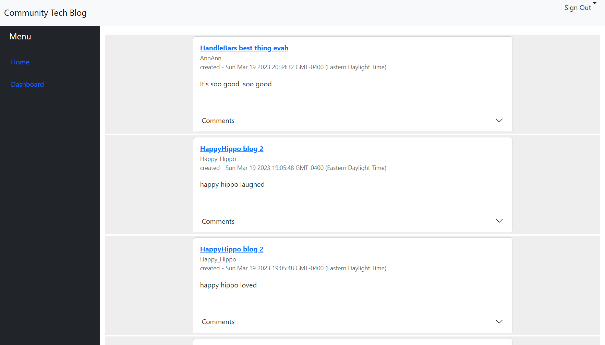
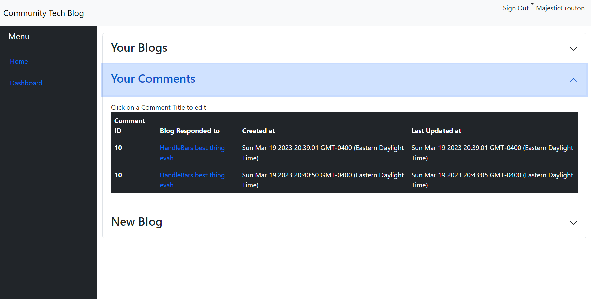

# Community Tech Blog

## Description

This application is a simple blog site with the ability to register and login users, post, comment, and update blogs. Provisions have been added to include comments to other comments for future upgradability.

The site includes a simple dashboard for the user to upkeep their posts.

The data storage is based on mySQL and the current deployment employs a jaws DB server to hold user and blog data.

## Table of Contents

- [Installation](#installation)
- [Usage](#usage)
- [Contributing](#contributing)
- [How-to-Contribute](#how-to-contribute)
- [Tests](#tests)
- [Questions](#questions)
- [License](#license)

## Installation

Clone repo from the github link, in the CLI run npm i, if you want to test the site it is reccomended that you run the seed command "npm run seed". run npm run to start your server locally.

In addition you will need to create a .env file or make sure the evniroment variable JAWSDB_URL is accounted for in your setup. you can create a .env file in your repo with the following.

  JAWSDB_URL = <URI to your chosen db>

## Usage

a database must be established on your choice of mySQL, and a URI for that database must be provided and coded into the .env file.

npm start and you are running off your local machine.

## Contributing

n/a

## How-to-contribute

n/a

## Tests

n/a

## Questions

For any questions refer to the MagicCrouton repository https://github.com/MagicCrouton/TechBlogSite
or email inqueries to e.park5336@gmail.com

## License

This application is covered under the MIT license